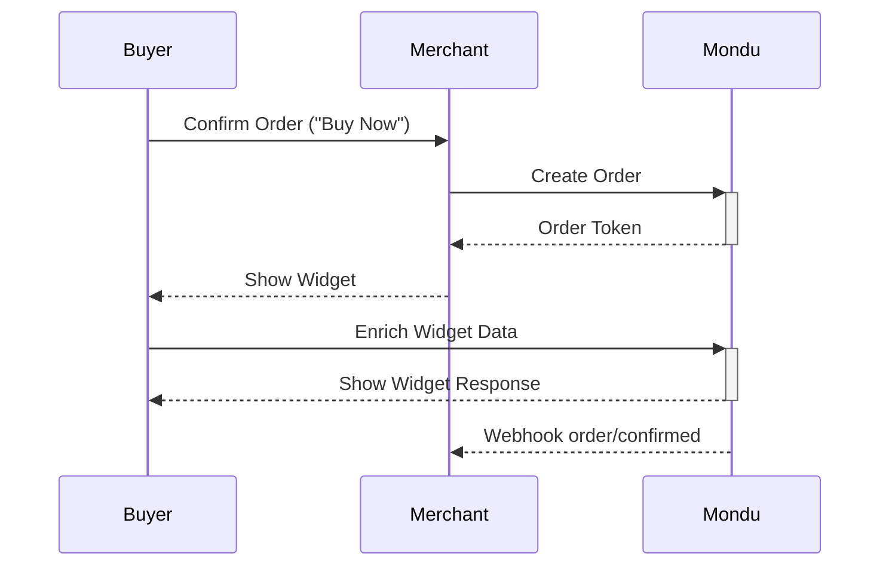
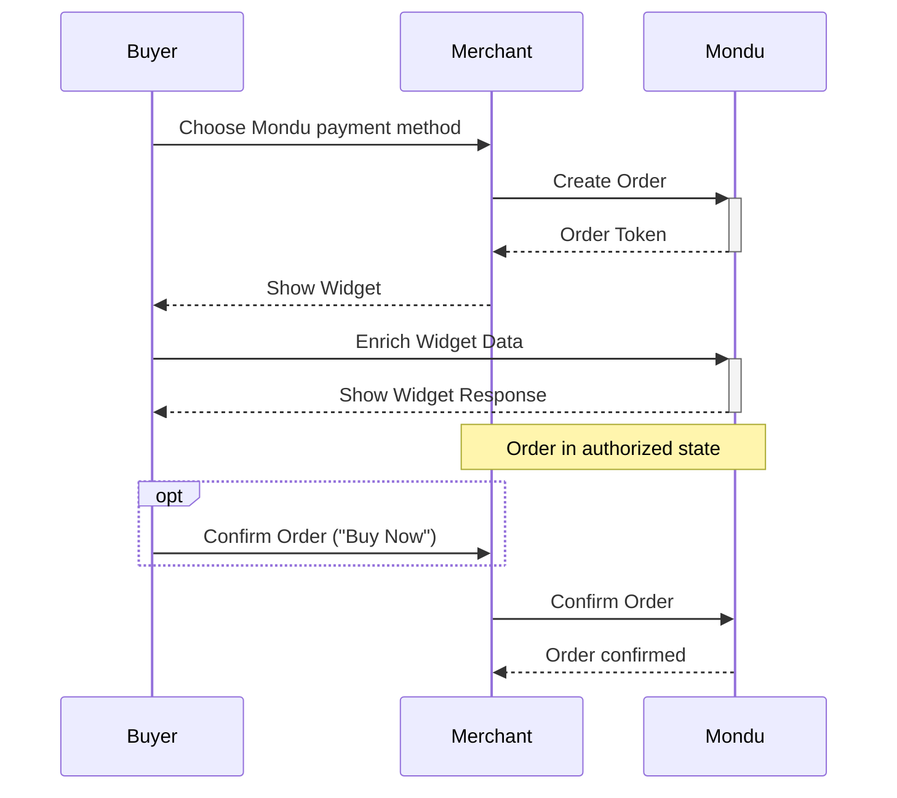

# 🚧 Mondu Demo Integration 🚧
This repo aims to help you in setting up a demo app for Mondu BNPL. It's built with:

- NodeJS
- Express
- Pug as templating engine
- axios and fetch for async API communication
- Bootstrap

However, it's the first app I'm writing using NodeJS and express, so expect bugs, 🍝-code and general nastyness. 
It's a work in progress.


## How To Run

```bash
git clone git@github.com:hreinberger/mondu-node.git && cd mondu-node
cp .env.example .env
nano .env
# insert your API key in the .env
npm install
npm start
```
You can now access the app at `localhost:3000`.

### Bring your own API Key

In order for the app to work, wou'll have to set your Mondu API key in the `.env` file. Don't have one yet? Reach out to your Mondu representative!

## Docker

The Repo is prepared to be run in a vscode dev container, Github Codespace or dockerized on any machine you like. 
To run it in a more production-like environment, you can do this:

```bash
docker compose build && docker compose up -d
```
⚠️ The app is not checked for vulnerabilities, so be careful when you want to run it in a public environment (like the Internet!)

## Payment Flows

The app has support for two types of UX flows.

### Confirmation Flow (Mondu Default)

In this flow, Mondu confirms or declines an order once the buyer's interaction with the widget is complete.



### Authorization Flow

Here, Mondu will save orders with successful widget interactions in the `authorized` state.
The order then needs to be confirmed by the merchant with an addidtional API request.




## To Do

✅ - Demo Checkout working

✅ - Dockerize and setup for devcontainer/Github Codespace

✅ - Mondu Confirmation- and Authorization Flow

⬜ - Order management "backend"

⬜ - Invoice Workflow

⬜ - Webhooks