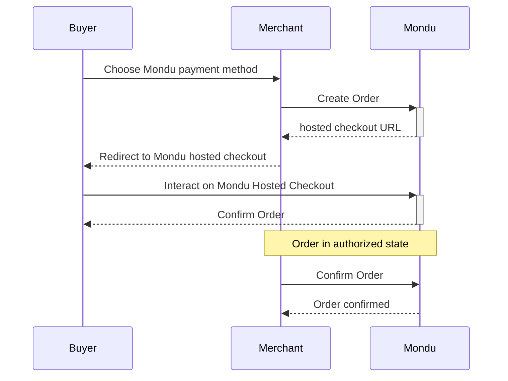
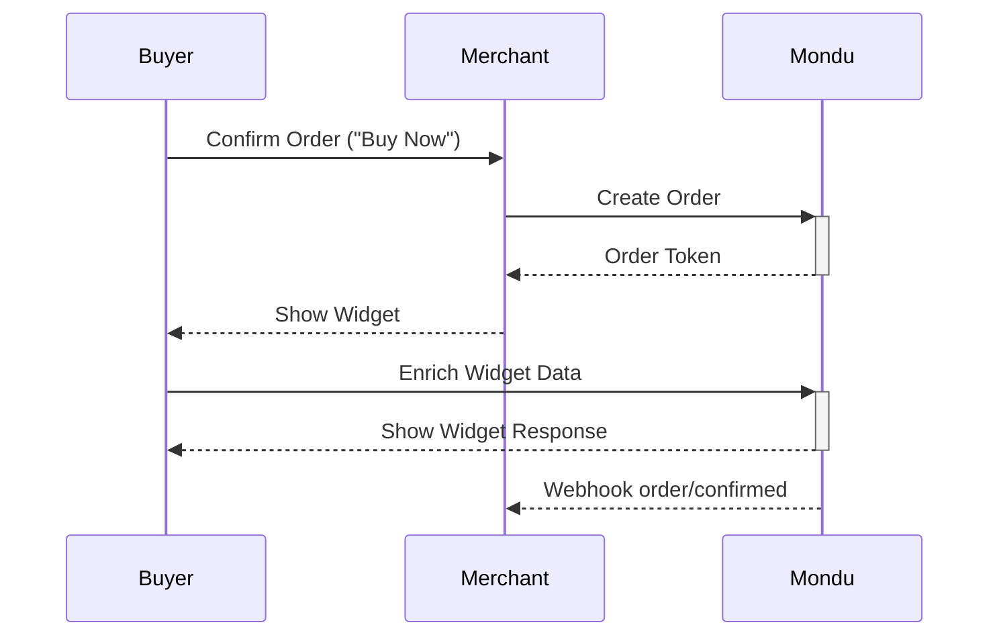

# 🚧 Mondu Demo Integration 🚧

This repo aims to help you in setting up a demo app for Mondu BNPL. It's built with:

- NodeJS
- Express
- Pug as templating engine
- axios and fetch for async API communication
- Bootstrap


## How To Run

```bash
git clone git@github.com:hreinberger/mondu-node.git && cd mondu-node
cp .env.example .env
nano .env
# insert your API key in the .env
npm install
npm start
```

You can now access the app at `localhost:3000`.

### Bring your own API Key

In order for the app to work, wou'll have to set your Mondu API key in the `.env` file. Don't have one yet? Reach out to your Mondu representative!

## Docker

The Repo is prepared to be run in a vscode dev container, Github Codespace or dockerized on any machine you like.
To run it in a more production-like environment, you can do this:

```bash
docker compose build && docker compose up -d
```

⚠️ The app is not checked for vulnerabilities, so be careful when you want to run it in a public environment (like the Internet!)

## Payment Flows

The app has support for two types of UX flows.

### Hosted Checkout (Recommended)

Here, Mondu will save orders with successful hosted checkout interactions in the `authorized` state.
The order then needs to be confirmed by the merchant with an addidtional API request.

For this flow to work, the app opens a localtunnel to your machine. Upon redirection to the success page of the app, you'll need to enter your current public IP as an anti-abuse method. The app logs the public IP to console on every start.




### Confirmation Flow (Mondu Widget)

In this flow, Mondu confirms or declines an order once the buyer's interaction with the widget is complete.



## "Backend"

You can show recent orders by visiting the `/orders` page.


## "Webhooks"

You can show registered webhooks by visiting the `/webhooks` page.

You can register the webhooks for two topics at the moment:

- order by clicking upon `Regiter Order Webhook`,

- invoice by clicking upon `Regiter Invoice Webhook`,

If there there other webhook registerd for a given topic, please use `Remove` button to remove the endpoint and regitring the new one. 

Remember that other applications might use the webhooks you want to remove. 


## To Do

✅ - Demo Checkout working

✅ - Dockerize and setup for devcontainer/Github Codespace

✅ - Mondu Confirmation- and Authorization Flow

✅ - Mondu Hosted Checkout Flow

⬜ - Order management "backend"

⬜ - Invoice Workflow

✅ - Webhooks
